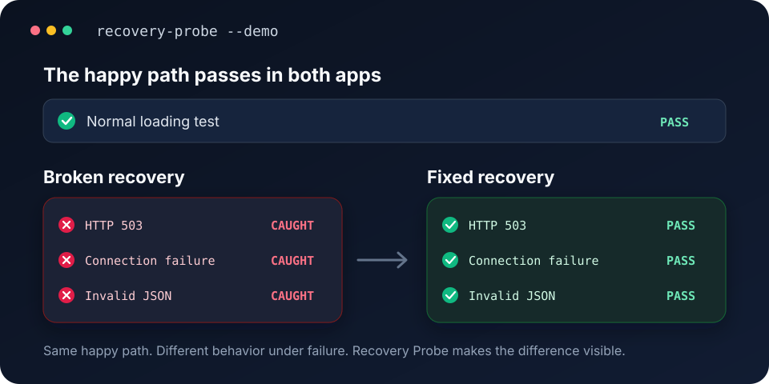

> Experimental IPC discovery (preview.6, GitHub build): compare three healthy baselines with single/double rejections and null results, without a readiness selector. Findings are heuristic leads, not automatic fixes. [Setup and limitations](docs/ipc.md#experimental-discovery-preview6).

# Recovery Probe

[](https://github.com/BojanKovachki/recovery-probe/actions/workflows/validate.yml)
[](https://www.npmjs.com/package/recovery-probe)
[](https://nodejs.org/)
[](LICENSE)

**Find reproducible request-recovery bugs in web and Electron apps. Propose a source fix, then test the candidate.**

A happy-path test can pass while a transient failed request leaves an app permanently loading. Recovery Probe injects controlled failures and checks what happens next. Recovery may be automatic; a Retry button or special recovery screen is not required.

## Release status

| Version | Available functionality |
| --- | --- |
| npm `0.2.0` | Playwright/fetch fault helpers and the original configured CLI. No source investigation or automatic fixes. |
| npm `0.3.0-preview.2` (`next` as of October 5) | Web/Electron discovery and checks; login-state support; opt-in AI proposals and isolated verification. |
| GitHub `0.3.0-preview.3` (prepared for npm publication) | Guided first run: browser setup, window/request selection, click-to-select loaded content, saved setup and one-command reruns. |
| GitHub `0.3.0-preview.4` (prepared for npm publication) | Development-only IPC rejection/null-result adapter and noninteractive desktop checks through a main-process registration hook. |
| GitHub `0.3.0-preview.5` (prepared for npm publication) | Inspector control reliability and verified cleanup after uncertain IPC begin/reset replies. Use this build for IPC testing. |
| Not implemented | General discovery/fixing of arbitrary bugs, production self-healing, autonomous deployment, native/Rust HTTP transport interception. |

The repair preview needs a local source repository, explicit source-file selection, one expected outcome, app launch/test commands, and your own API key/model for generation. It does **not** obtain these from installing an npm dependency. It returns a reviewable candidate, not a guaranteed fix. [Full setup and safety guide](docs/repair.md).

## Guided start (preview.3)

Start your development app as usual. In a separate tools folder, these three commands install and run the guided preview from GitHub until preview.3 is published:

```bash
mkdir recovery-probe-tools && cd recovery-probe-tools
npm install --save-dev github:BojanKovachki/recovery-probe#main playwright@1.62.1
npx recovery-probe start web http://localhost:3000
```

For Electron, use `npx recovery-probe start desktop` instead. Electron must first expose its loopback development debugging port; [see the setup guide](docs/start.md). Pin a GitHub commit for reproducibility. After preview.3 is published, install `recovery-probe@0.3.0-preview.3` in place of the GitHub reference.

Chromium is downloaded automatically if missing. Sign in, choose a request if several are found, then click the loaded content that proves recovery. Confirm automatic recovery or enter the Retry button's visible label. No window-index lookup, handwritten selectors or JSON editing is needed for this flow.

Next time run `npx recovery-probe start web` or `npx recovery-probe start desktop` from the same folder. The saved expectation and login state are reused. `--fresh` refreshes login and choices; `--dir` keeps separate scenarios. Reports and auth stay in a locally ignored folder. These checks do not read source code or call AI services.

This is guided setup, not autonomous discovery of business requirements. One chosen GET endpoint and one user-confirmed content marker are tested; general native software and Rust networking need other adapters; IPC reads can use the separate preview.4 hook. [Full guided-start instructions](docs/start.md).



## Does this cover my desktop app?

The desktop adapter currently intercepts **renderer GET fetch/XHR requests**, not the entire application's network stack. An Electron UI can load all its data through preload → IPC → a main-process or Rust client while exposing no interceptable renderer requests. In that architecture, connection/discovery alone cannot measure recovery. An empty discovery result is inconclusive, never a pass.

If the application also has a browser build using ordinary fetch/XHR, test that build for a renderer recovery measurement. This does not validate the desktop IPC/native path. For main-process IPC reads, preview.4 adds an explicit development-only registration hook and noninteractive checker: [IPC setup](docs/ipc.md). It tests renderer recovery after IPC rejection/null results, not Rust or HTTP behavior. Playwright can still drive the UI when those adapters are added.

Electron attachment uses Playwright's `noDefaults` option to leave the existing application's download/focus/media settings alone. CI runs real attachment, fault checks and guided reruns on Electron 29.0.1 and 44.5.1; this is not a guarantee for every version or app architecture.

## What it catches

Consider an application that loads normally, but forgets to clear its loading state after an error. Its ordinary end-to-end test stays green. After a transient `503`, interrupted request, or malformed response, Retry does nothing.

Recovery Probe makes that failure deterministic:

1. Match one endpoint and request method.
2. Inject a bounded fault without replacing global `fetch`.
3. Run the real recovery interaction and assertion.
4. Fail if the fault was never observed, so a wrong route cannot create a false positive.
5. Remove only its own route handler and preserve existing mocks.

## Web and Electron preview

Use `web` for a Chromium portal and `desktop` to attach to an existing development Electron renderer. Both use the same Page-level checking engine. Checks discover GET JSON endpoints, inject selected faults, and produce local evidence. Use the separate `repair` command to reproduce in a clean checkout, request an AI proposal with explicit upload consent, and rerun the scenario after applying the candidate only to that copy. See [web/repair setup](docs/repair.md) and [desktop attachment](docs/desktop.md). npm 0.2.0 includes neither workflow.

## Install

Recovery Probe is designed to be added to an existing Playwright project:

```bash
npm install --save-dev recovery-probe
```

Node.js 22 or newer is required. Playwright is an optional peer dependency: the fetch-only API works without it, while browser/desktop commands require Playwright `^1.62.1` (1.x).

## Quick start

Use `withFault` inside an existing Playwright test. The callback contains the real user action and the application-specific recovery assertion.

```js
import { test, expect } from '@playwright/test';
import { withFault } from 'recovery-probe';

test('profile recovers after a transient 503', async ({ page }) => {
  const stats = await withFault(page, {
    match: '**/api/profile',
    kind: 'http-error',
    status: 503,
    count: 1,
  }, async () => {
    await page.goto('http://127.0.0.1:3000/profile');
    await page.getByRole('button', { name: 'Retry' }).click();
    await expect(page.getByTestId('profile-name')).toHaveText('Test User');
  });

  expect(stats.applied).toBe(1);
});
```

If the endpoint does not match, Recovery Probe throws `FAULT_NOT_TRIGGERED` instead of allowing the test to pass silently. If the fault is applied but the recovery assertion fails, it throws `RECOVERY_ASSERTION_FAILED` and retains the original assertion error as `cause`.

## Run the demonstration

The repository includes deliberately broken and corrected applications. Both pass their normal loading check; only the corrected application recovers from all three faults.

```bash
npm install
npx playwright install chromium
npx recovery-probe --demo
```

The command prints a concise comparison:

```text
broken synthetic fixture
  PASS         Normal connection (OK)
  CAUGHT       HTTP 503 once (RECOVERY_ASSERTION_FAILED, injected 1)
  CAUGHT       Interrupted request once (RECOVERY_ASSERTION_FAILED, injected 1)
  CAUGHT       Malformed JSON once (RECOVERY_ASSERTION_FAILED, injected 1)

fixed synthetic fixture
  PASS         Normal connection (OK)
  PASS         HTTP 503 once (OK, injected 1)
  PASS         Interrupted request once (OK, injected 1)
  PASS         Malformed JSON once (OK, injected 1)
```

`--demo` exits successfully only when it observes the expected contrast: the happy path passes, the broken recovery is caught, and the corrected flow passes. Add `--json` to print the full report or `--out report.json` to save it.

## Supported faults

| Kind | Injected behavior |
| --- | --- |
| `http-error` | Fulfils the matched request with an HTTP error status; defaults to `503`. |
| `connection-failure` | Aborts the matched Playwright request with `connectionfailed`, or throws from the fetch adapter. |
| `invalid-json` | Returns status `200` with a deliberately malformed JSON body. |

Faults are bounded by `count` (default `1`, maximum `20`). The count is reserved synchronously, so concurrent matching requests cannot over-inject.

## Fetch-only tests

The lightweight `recovery-probe/fetch` entry point has no runtime dependencies and does not require Playwright. It matches one exact absolute URL, including its query string, and never patches global `fetch`.

```js
import { createFaultFetch } from 'recovery-probe/fetch';

const probe = createFaultFetch(fetch, {
  url: 'http://127.0.0.1:3000/api/profile',
  kind: 'connection-failure',
});

await exerciseApplication(probe.fetch);
probe.assertApplied();
```

`exerciseApplication` represents your own test adapter or application controller. Calling `assertApplied()` is essential: it proves that every requested fault was consumed.

## JSON-configured runner

The CLI supports pages that automatically load GET data, expose a visible Retry button after failure, and show a ready element after recovery.

```json
{
  "name": "Profile recovery",
  "url": "http://127.0.0.1:3000/profile",
  "requestPattern": "**/api/profile",
  "readySelector": "[data-testid=profile-ready]",
  "retrySelector": "[data-testid=profile-retry]",
  "timeoutMs": 3000
}
```

```bash
npx recovery-probe --config recovery-probe.json --out artifacts/profile-recovery.json
```

The runner first checks the normal baseline in a fresh browser context. If that baseline fails, fault comparisons are skipped and reported as inconclusive. Each fault then receives its own fresh context with service workers blocked so Playwright can intercept the request.

Exit codes:

- `0`: every configured check passed, or the controlled demo observed its expected broken-versus-fixed result.
- `1`: a recovery check failed, was inconclusive, or was skipped.
- `2`: invalid arguments, configuration, or environment setup.

## Result semantics

| Code | Meaning |
| --- | --- |
| `OK` | The configured assertion completed and the expected fault count was observed. |
| `RECOVERY_ASSERTION_FAILED` | The fault occurred, but the recovery assertion did not pass. |
| `FAULT_NOT_TRIGGERED` | The requested fault count was not observed. Check the route, method, cache, and service worker. |
| `BASELINE_FAILED` | The ordinary flow failed, so the runner could not make a useful fault comparison. |
| `INJECTION_ERROR` | Playwright could not apply or clean up the route reliably. |

A passing result proves the configured recovery behavior for that test. It is not a certification of overall application resilience.

## API

### `withFault(page, options, exercise)`

Installs one temporary Playwright route, runs `exercise`, verifies the requested fault count, and removes only that route handler.

```ts
interface FaultOptions {
  match: string | RegExp;
  kind: 'http-error' | 'connection-failure' | 'invalid-json';
  status?: number;
  count?: number;
  method?: string;
}
```

Register the fault after your own route mocks. The helper uses `route.fallback()` for requests it does not inject, allowing earlier handlers to continue processing them.

### `createFaultFetch(baseFetch, options)`

Creates an isolated fetch wrapper for one exact URL and method. It returns `{ fetch, summary, assertApplied }` and leaves the supplied fetch function unchanged.

### `probeRecovery(browser, config)`

Runs the baseline and the three default recovery checks used by the JSON CLI. For custom interactions or stronger assertions, prefer `withFault` inside your own test.

## Scope

Recovery Probe deliberately focuses on deterministic request-level recovery checks. It does not simulate whole-device offline states, WebSocket interruptions, token expiry, browser sleep, slow-network profiles, or duplicate-submission safety.

Playwright already provides the routing primitives used here. Recovery Probe adds bounded recipes, fault-occurrence verification, cleanup, consistent result codes, a fetch adapter, and a runnable broken-versus-fixed example. If a few direct `page.route()` calls are clearer for your test, use them; this package is most useful when teams want the recovery pattern to be repeatable.

The runner requires explicit selectors and endpoint matching. It does not discover an application's recovery policy automatically. Request/response bodies and headers are not collected by the checker. Preview reports include endpoint origin/path, selectors, expected text and configuration; optional screenshots, login state and command logs may be sensitive. Do not commit or share these blindly.

Recovery Probe sends no telemetry. Tests/discovery do not call an AI service. Only explicit repair generation with `--allow-source-upload` sends the selected source contents and bounded observations to the configured OpenAI model. Login state and command logs are not part of that upload bundle. `store: false` is set on the API request; this is not a promise of zero provider retention. Review employer policy and provider data terms first.

## Development

```bash
npm ci
npm test                 # 9 fetch/core tests
npm run test:package     # isolated tarball install + TypeScript + CLI checks
npx playwright install chromium
npm run test:browser     # 7 real-browser integration tests
npm run test:repair      # safety, authenticated portal, before/after pipeline
# After installing the optional Electron test runtime:
npm run test:repair:electron
npm run demo:browser
```

CI runs package checks on Node.js 22 and 24, Chromium integration, and real Electron checks. Repair integration tests use a **controlled mock model response** but real apps, fault injection, source changes and reruns. They validate orchestration, not live AI diagnosis quality. See [CONTRIBUTING.md](CONTRIBUTING.md) and [SECURITY.md](SECURITY.md).

## License

[MIT](LICENSE) © 2026 Bojan Kovachki
